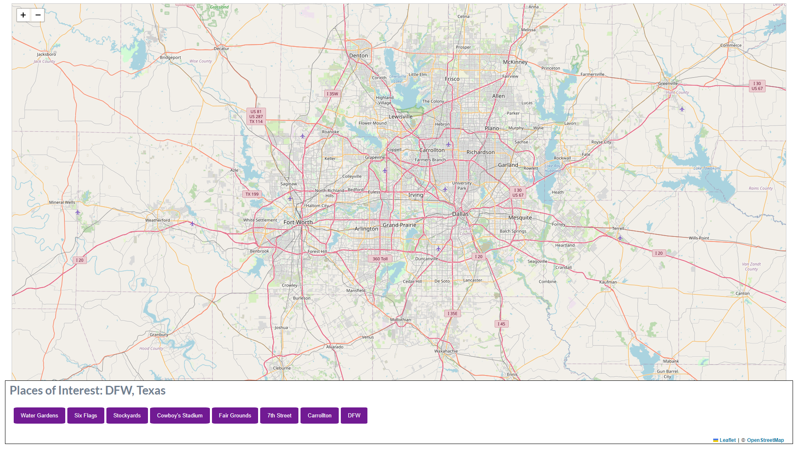

# co-project14-Map
 Map for project 14 for Correlation One

## To Do

- [x] Create basic framework for map and functions
- [x] Use Leaflet
- [x] Use Open Street Map
- [x] Include buttons to places within DFW
- [x] Link buttons to coordinates properly with zoom
- [x] Have popUps with information about the place
- [x] Include the last button to zoom back out with all places clicked still showing